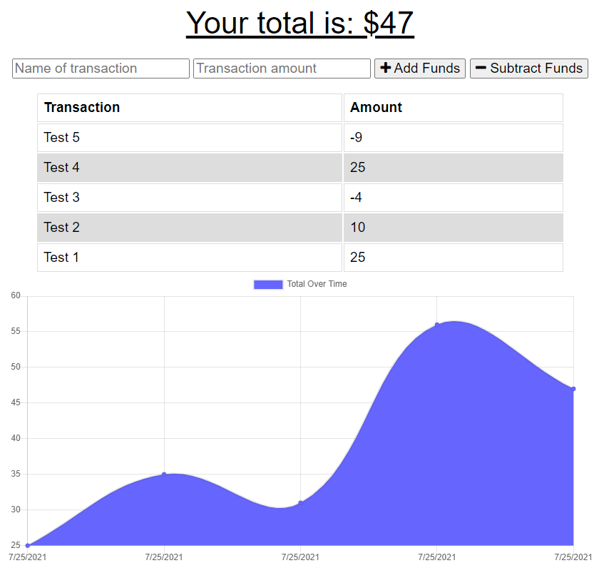

# budget-tracker

## Summary:

For this project, most of the code for the application was provided in the source materials for the homework. Only the code contained in the indexedDB.js file was added to enable the app to work offline.

## Functionality:

The application allows the user to add and subtract funds and see a visual representation of the available amount.

The app can operate offline using indexedDB. When the user is online again, all the transactions are then sent to the MongoDB of the application and deleted from indexedDB.

## Deployed App Link:

[Budget Tracker APP](https://murmuring-castle-74097.herokuapp.com/)

## Images:

